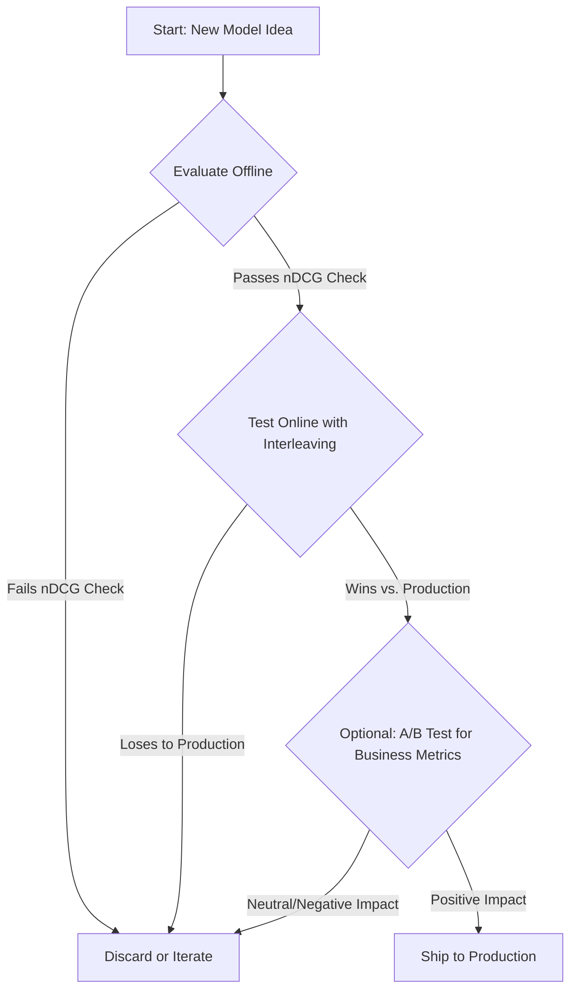

# Chapter 13: Evaluating Ranking Systems: From Offline Metrics to Online Interleaving

Evaluating improvements to **ranking functions** and **recommendation algorithms** requires combining the speed and safety of **offline evaluation** with the definitive, high-sensitivity results of **online interleaving experiments**.

This chapter covers two complementary validation stages:

1.  **Offline Evaluation:** Fast, zero-cost iteration using historical data and metrics like nDCG.
2.  **Online Interleaving Tests:** Highly sensitive live experiments comparing user preferences between two algorithms.

Using these methods sequentially allows rapid iteration while ensuring only promising candidates reach users.

## Table of Contents
- [Chapter 13: Evaluating Ranking Systems: From Offline Metrics to Online Interleaving](#chapter-13-evaluating-ranking-systems-from-offline-metrics-to-online-interleaving)
  - [Table of Contents](#table-of-contents)
  - [1. Online Interleaving: High-Sensitivity Live Testing](#1-online-interleaving-high-sensitivity-live-testing)
    - [1.1. Structural Design](#11-structural-design)
    - [1.2. The Statistical Advantage](#12-the-statistical-advantage)
  - [2. Hypothesis Testing Structure](#2-hypothesis-testing-structure)
    - [2.1. The Hypothesis](#21-the-hypothesis)
    - [2.2. The Test Statistic: Normalized Click Rate](#22-the-test-statistic-normalized-click-rate)
    - [2.3. Sample Size Considerations for Interleaving Tests](#23-sample-size-considerations-for-interleaving-tests)
      - [Factors Affecting Required Sample Size](#factors-affecting-required-sample-size)
      - [Practical Guidelines](#practical-guidelines)
      - [Determining Experiment Duration](#determining-experiment-duration)
  - [3. Key Interleaving Algorithms](#3-key-interleaving-algorithms)
    - [3.1. Method 1: Team Draft Interleaving (TDI)](#31-method-1-team-draft-interleaving-tdi)
    - [3.2. Method 2: Probabilistic Interleaving (P-Interleaving) Score](#32-method-2-probabilistic-interleaving-p-interleaving-score)
  - [4. Statistical Test Selection: Wilcoxon Signed-Rank Test](#4-statistical-test-selection-wilcoxon-signed-rank-test)
    - [4.1. Why Test the Median Instead of the Mean?](#41-why-test-the-median-instead-of-the-mean)
    - [4.2. The Core Structure and Hypothesis](#42-the-core-structure-and-hypothesis)
      - [4.2.1. Assumptions](#421-assumptions)
    - [4.3. The Ranking Procedure](#43-the-ranking-procedure)
    - [4.4. The Decision Process](#44-the-decision-process)
      - [The Critical Value (Table Look-up)](#the-critical-value-table-look-up)
      - [The Decision Rule](#the-decision-rule)
      - [Normal Approximation (for large $N$)](#normal-approximation-for-large-n)
    - [4.5. Intuition for Testing Against $\\mathbf{d=0}$](#45-intuition-for-testing-against-mathbfd0)
    - [4.6. Derivation of the Critical Threshold](#46-derivation-of-the-critical-threshold)
      - [Generation of the Critical Threshold Table](#generation-of-the-critical-threshold-table)
  - [5. Implementation Examples](#5-implementation-examples)
    - [5.1. Interleaving Results (Serving Time)](#51-interleaving-results-serving-time)
    - [5.2. Computing P-Interleaving Scores from Clicks](#52-computing-p-interleaving-scores-from-clicks)
    - [5.3. Statistical Analysis with Wilcoxon Test](#53-statistical-analysis-with-wilcoxon-test)
    - [5.4. End-to-End Data Processing Workflow](#54-end-to-end-data-processing-workflow)
    - [5.5. Power Calculation using Monte Carlo Simulation](#55-power-calculation-using-monte-carlo-simulation)
  - [6. Trade-offs Between Interleaving and Traditional A/B Tests](#6-trade-offs-between-interleaving-and-traditional-ab-tests)
    - [6.1. Ethical Considerations](#61-ethical-considerations)
      - [User Consent and Transparency](#user-consent-and-transparency)
      - [Potential for User Harm](#potential-for-user-harm)
      - [Fairness and Bias](#fairness-and-bias)
  - [7. Offline Evaluation: Validating Algorithms with Historical Data](#7-offline-evaluation-validating-algorithms-with-historical-data)
    - [7.1. The Core Idea: Replaying the Past](#71-the-core-idea-replaying-the-past)
    - [7.2. Common Offline Ranking Metrics](#72-common-offline-ranking-metrics)
      - [1. Precision@K](#1-precisionk)
      - [2. Mean Reciprocal Rank (MRR)](#2-mean-reciprocal-rank-mrr)
      - [3. Normalized Discounted Cumulative Gain (nDCG)](#3-normalized-discounted-cumulative-gain-ndcg)
    - [7.3. Hypothesis Testing in Offline Evaluation](#73-hypothesis-testing-in-offline-evaluation)
      - [The Meaning of a "Significant" Offline Result](#the-meaning-of-a-significant-offline-result)
    - [7.4. The Challenge: Counterfactual Evaluation](#74-the-challenge-counterfactual-evaluation)
    - [7.5. Role in the Experimentation Lifecycle](#75-role-in-the-experimentation-lifecycle)
  - [Industry Spotlight: Microsoft Bing's Journey with Interleaving](#industry-spotlight-microsoft-bings-journey-with-interleaving)
  - [Summary and Next Steps](#summary-and-next-steps)
  - [References and Further Reading](#references-and-further-reading)

---

## 1. Online Interleaving: High-Sensitivity Live Testing

The fundamental principle of interleaving is to have the **same user** evaluate two or more algorithms **simultaneously** in a single user interface.

### 1.1. Structural Design

1.  **List Generation:** Two competing ranking algorithms, A and B, each produce their own list of search results or recommendations for a single user query.
2.  **Interleaving:** These two lists are merged into a single, unified list that is presented to the user. The items are mixed using a **randomized pattern** (e.g., $A_1, B_1, A_2, B_2, \dots$) to control for the impact of **positional bias**—the well-documented tendency for users to click items at higher-ranked positions regardless of their relevance.
3.  **Exposure:** All users in the experiment see this interleaved list. The system internally records which algorithm generated which result.

### 1.2. The Statistical Advantage

Interleaving provides **10× to 100× greater sensitivity** than standard A/B tests [2].

* **Each User is Their Own Control:** Exposing the same user to both algorithms in one session eliminates user-specific variance (device, mood, preferences, query ambiguity)—the primary noise source in traditional A/B tests.
* **Faster Iteration:** Reduced variance enables detection of small quality differences with less traffic and shorter experiments.

---

## 2. Hypothesis Testing Structure

Interleaving tests are structured as a **paired two-sample test on the differences**, focusing on **relative preference** rather than absolute performance.

### 2.1. The Hypothesis

* **Unit of Observation:** Individual user-query session
* **Null Hypothesis ($\mathbf{H_0}$):** Algorithms are equally preferred
    $$\mathbf{H_0: \text{Preference for A} = \text{Preference for B}}$$
* **Alternative Hypothesis ($\mathbf{H_a}$):** Algorithms differ in click-through preference

### 2.2. The Test Statistic: Normalized Click Rate

Raw click differences ($\text{Clicks}_A - \text{Clicks}_B$) are biased by position. The test statistic uses a **bias-corrected score** adjusting for each algorithm's exposure at click-prone positions.

Two algorithms compute this score: **Team Draft Interleaving (TDI)** and **Probabilistic Interleaving (P-Interleaving)**.

### 2.3. Sample Size Considerations for Interleaving Tests

A critical question when designing an interleaving experiment is: **How many queries (user sessions) are needed to detect a meaningful difference?**

#### Factors Affecting Required Sample Size

1.  **Expected Effect Size:** The magnitude of the difference between algorithms. Smaller differences require more queries to detect reliably. For ranking experiments, practitioners often aim to detect improvements as small as 1-3% in click-through preference.

2.  **Baseline Click-Through Rate (CTR):** Lower CTR means more queries are needed. If only 5% of queries result in clicks, most sessions contribute zero differences, reducing statistical power.

3.  **Variance in User Behavior:** Even with pairing, users vary in their query difficulty and click propensity. High variance requires larger samples.

4.  **Desired Statistical Power:** Standard practice is to aim for 80% power (probability of detecting a true effect) at α = 0.05 significance level.

#### Practical Guidelines

While exact power calculations for the Wilcoxon test require simulation, practical guidelines from industry experience [2, 5] suggest:

*   **Minimum Sample:** At least 1,000-5,000 queries with non-zero click differences for small to medium effect sizes
*   **Typical Range:** Most interleaving experiments run with 10,000-100,000 queries
*   **Duration:** Given the high sensitivity of interleaving, experiments often reach significance within 1-7 days, compared to weeks for traditional A/B tests

The substantial reduction in required sample size (often 10-100× smaller than traditional A/B tests) is the primary advantage of interleaving, enabling faster iteration cycles.

For detailed power calculations and sample size planning, see Section 5.5 which provides Monte Carlo simulation code to estimate the required number of queries for specific scenarios.

#### Determining Experiment Duration

Rather than pre-specifying duration, many teams use **sequential testing** approaches [8] where they check results periodically (e.g., daily) after reaching a minimum sample threshold. However, care must be taken to control for multiple testing issues through appropriate corrections (e.g., using spending functions or adjusting α).

---

## 3. Key Interleaving Algorithms

### 3.1. Method 1: Team Draft Interleaving (TDI)

TDI focuses on structural fairness to mitigate bias and relies on a simple **win/loss system** to compute the per-query scores.

1.  **Exposure and Click Logging:** For every user query, the results from Algorithm A and Algorithm B are blended into a single list. The system logs which algorithm contributed each item that was **clicked**.
2.  **Credit Assignment:** A click on an item is assigned as a *win* to the algorithm that sourced it. The TDI blending algorithm ensures that both algorithms contribute roughly equal numbers of items to high-click positions.
3.  **The Per-Query Scores (A and B):** For a single query, the score for each algorithm is its total number of wins (clicks) in that query.
    *   $\text{Score}_{\text{A}} = \text{Count of clicks on A's items in the query}$
    *   $\text{Score}_{\text{B}} = \text{Count of clicks on B's items in the query}$
4.  **The Per-Query Difference:** We then compute the difference, $d_i$, for each query $i$:
    $$d_i = \text{Score}_{\text{A},i} - \text{Score}_{\text{B},i}$$
5.  **The Statistical Test:** The final statistical test is performed on the **collection of all per-query differences ($d_1, d_2, \dots, d_n$)} from the experiment. The test (e.g., Wilcoxon Signed-Rank) determines if the central tendency (e.g., the median) of this sample of differences is significantly different from zero.

### 3.2. Method 2: Probabilistic Interleaving (P-Interleaving) Score

P-Interleaving is a more rigorous approach that uses **explicit exposure probabilities** for normalization. This method calculates a bias-corrected score for each algorithm *within a single query*, which then becomes the basis for the final statistical test.

1.  **Probabilistic Assignment:** In P-Interleaving, the item placed at position $k$ is selected based on a known probability factor, $P(\text{Model} | \text{Rank})$. This means the likelihood that an item from Algorithm A is shown at a position (a rank) is a known value, usually constant over all queries. This is also referred to as the A's presentation probability noted as: $P(\text{an item of A was shown at that rank position})$.
2.  **Click Weighting:** If a click occurs at position $k$, it is weighted based on the ranking position of the clicked item. This `PositionWeight` intends to encourage algorithms to rank clicked items at higher ranking positions.
3.  **The Per-Query Score:** For a single query, the normalized score for each algorithm is the sum of the weighted scores for all clicks it received *in that query*.
    $$\text{Score}_{\text{A}} = \sum_{\text{clicks in query}} \frac{\text{PositionWeight}}{P(\text{A's item was shown at that rank position})}$$
    This calculation yields a single number representing the click-effectiveness of Algorithm A for that specific query, independent of positional luck.
4.  **The Test Statistic:** The final statistical test is conducted on the **list of differences** between these per-query scores, calculated across all queries in the experiment. For each query, we compute the difference:
    $$d_i = \text{Score}_{\text{A},i} - \text{Score}_{\text{B},i}$$
    The statistical test (e.g., Wilcoxon Signed-Rank) is then performed on the collection of all $d_i$ values to see if the median difference is significantly different from zero.

Intuition: The score for Algorithm A on a single query $\text{Score}_{\text{A}}$ is the sum of its weighted and normalized clicks. Each click's contribution is twofold: it is weighted by the importance of its position, giving more value to clicks on higher-ranked items, and it is also normalized by the probability that an item from Algorithm A would appear at that clicked position. This normalization corrects for positional bias in the interleaving process, ensuring a fair comparison. This results in a bias-corrected score for each query, which becomes one data point in our final paired analysis.

---

Now that we have computed per-query scores (using either TDI or P-Interleaving) and calculated the difference $d_i$ for each query, we must choose an appropriate statistical test to determine whether Algorithm A is significantly better than Algorithm B. The choice of statistical test is critical because the distributional properties of interleaving data—discrete values, sparsity, and a concentration of zeros—violate the assumptions of many standard tests.

## 4. Statistical Test Selection: Wilcoxon Signed-Rank Test

The `Wilcoxon Signed-Rank Test` is a non-parametric test for paired data that tests whether the **median of the differences** is zero. It provides a robust alternative to the Paired T-Test when data violates normality assumptions—as with the discrete, zero-inflated click differences typical of interleaving experiments.

### 4.1. Why Test the Median Instead of the Mean?

Interleaving data has two critical properties that make **median-based tests** more appropriate than **mean-based tests**:

**1. Heavy Zero-Inflation:**
Most queries produce zero difference ($d_i = 0$) because either no clicks occur or both algorithms receive equal clicks. For example:
* **TDI:** Differences are integers (0, ±1, ±2, ...) with 60-80% being zero
* **P-Interleaving:** Differences are continuous but still 60-80% are zero

**2. Extreme Outliers:**
When non-zero differences occur, they can be large due to positional effects or rare queries. A single query where Algorithm A gets 5 clicks and Algorithm B gets 0 creates $d_i = 5$, which heavily influences the mean.

**Why the Median is Robust:**
* **Median is insensitive to outliers:** Whether the largest difference is 5 or 50, the median only cares about the middle value
* **Median handles zero-inflation:** The median focuses on the typical non-zero difference, not the arithmetic average contaminated by zeros
* **Median doesn't require normality:** Unlike the mean (which needs CLT or normality for valid inference), the median can be tested non-parametrically

**Why Normality of Mean Breaks Down even if we test on Mean?**

The Paired T-Test relies on the **Central Limit Theorem (CLT)** to justify that $\bar{d}$ follows a normal distribution, even when individual differences $d_i$ are not normal. But CLT converges too slowly for practical sample sizes when data is zero-inflated and skewed, which are the case for our interleaving data:

* **Zero-inflation (60-80% zeros) + extreme skewness** means the sample mean converges to normality very slowly—often requiring hundreds of thousands of queries
* **At typical sample sizes (1K-100K queries)**, the sampling distribution of $\bar{d}$ remains non-normal, particularly in the tails where p-values are calculated ($\alpha = 0.05$)

The breakdown of CLT in case of means-based T-Test leads to **inflated Type I error rates**: rejecting $H_0$ more than 5% of the time when it's true

| Test | Statistical Rationale |
| :--- | :--- |
| **Paired T-Test (Avoided)** | Relies on the **Central Limit Theorem (CLT)** to justify that the sample mean $\bar{d}$ is approximately normal. For interleaving data (heavily zero-inflated, right-skewed), CLT convergence is extremely slow. At practical sample sizes, the t-test produces unreliable p-values and inflated Type I errors. |
| **Non-Parametric Paired Tests (Preferred)** | Tests like the **Wilcoxon Signed-Rank Test** use **ranks** instead of raw differences, making them robust to outliers and skewness. They test the median without relying on CLT, providing valid inference even for heavily non-normal data. |

### 4.2. The Core Structure and Hypothesis
The test requires matched pairs of observations ($A_i$ and $B_i$). It is structured to test the **median of the differences** ($d_i = A_i - B_i$) against a null value of zero.

$$\mathbf{H_0: \text{Median of Differences} = 0}$$

#### 4.2.1. Assumptions

For the Wilcoxon Signed-Rank Test to be valid, the following assumptions must be satisfied:

1.  **Paired Data:** The observations must come in matched pairs. In interleaving experiments, this means comparing Algorithm A and Algorithm B on the same query.
2.  **Independence:** The pairs must be independent of each other. Each user-query session should not influence other sessions.
3.  **Symmetric Distribution Under $H_0$:** The differences ($d_i$) should come from a distribution that is symmetric around the median under the null hypothesis. This assumption is generally robust and less restrictive than the normality assumption required for the t-test.
4.  **Continuous or Ordinal Scale:** The differences should be measured on at least an ordinal scale (though the test is robust to discrete data in practice).

In the context of interleaving experiments, these assumptions are typically well-satisfied: queries are independent, pairing is natural (same user seeing both algorithms), and while click differences are discrete, the test remains robust for this type of data [6, 7].

### 4.3. The Ranking Procedure
The test operates on ranks to avoid relying on the exact, potentially skewed magnitude of the raw differences:

1.  **Calculate Differences:** Find the difference $d_i$ for every pair.
2.  **Rank Absolute Differences:** Assign ranks to the absolute values of the non-zero differences ($|d_i|$), with the smallest difference getting rank 1. **Note on tied ranks:** When multiple differences have the same absolute value, assign each the average of the ranks they would have occupied (midrank method). For example, if three values tie for ranks 5, 6, and 7, each receives rank 6. Modern statistical software handles this automatically.
3.  **Calculate Test Statistic ($\mathbf{W}$):** Reattach the original sign to the ranks. Calculate the sum of the positive ranks ($\text{Sum}_{\text{Positive}}$) and the absolute sum of the negative ranks ($\text{Sum}_{\text{Negative}}$). The test statistic, $\mathbf{W}$, is the **smaller of these two sums by their absolute value**.

### 4.4. The Decision Process

#### The Critical Value (Table Look-up)

Statisticians have created tables that list the maximum value of $W$ (the smaller sum) that can be observed and still allow us to **fail to reject $H_0$** for a given $N$ and $\alpha$.

* **Look-up:** An analyst looks up the critical value in the Wilcoxon Signed-Rank Test table using two parameters:
    1.  The **Sample Size ($N$):** The number of non-zero differences in the paired observations.
    2.  The **Significance Level ($\alpha$):** The desired Type I error rate (e.g., $0.05$ for a $95\%$ confidence level).

#### The Decision Rule

Given total number of paired observations ($N$) in the sample and a specific ${\alpha}$ based on acceptable type I error,
if $\mathbf{W}$ <= ${CriticalValue_{\alpha, N}}$, $\mathbf{H_0}$ is rejected. Then:

* if $\text{Sum}_{\text{Positive}}$ > $\text{Sum}_{\text{Negative}}$, the median difference is positive.
* if $\text{Sum}_{\text{Positive}}$ < $\text{Sum}_{\text{Negative}}$, the median difference is negative.


**Rationale:** A very small $W$ indicates that the observed differences were **highly imbalanced**, with most of the large ranks falling on one side (e.g., positive differences) and only small ranks falling on the other side (e.g., negative differences). A small $W$ is evidence that the median difference is likely *not* zero.

#### Normal Approximation (for large $N$)

For larger sample sizes (typically $N \geq 10-20$ non-zero differences), the distribution of the $W$ statistic can be reasonably approximated by a **Normal distribution** (following the CLT) [6, 7]. In this case, the test statistic is converted into a $Z$-score, and the critical threshold is derived from the standard normal distribution table (e.g., $Z=1.96$ for a two-sided $\alpha=0.05$). Modern statistical software (such as scipy.stats.wilcoxon) automatically applies this approximation and generates a precise $p$-value. In practice, interleaving experiments typically involve hundreds or thousands of queries, making the normal approximation highly accurate.

---

### 4.5. Intuition for Testing Against $\mathbf{d=0}$

The intuition behind the Wilcoxon test's effectiveness lies in its focus on the **magnitude of the shift** rather than just the number of positive or negative differences.

* The total sum of all ranks possible for a given sample size $N$ is fixed by the formula for the sum of the first $N$ integers: $\text{Total Ranks} = \frac{N(N+1)}{2}$.
* **If $\mathbf{H_0}$ is True (No Difference):** If the two algorithms are truly identical, the positive and negative differences should be random. The sum of the ranks associated with positive differences ($\text{Sum}_{\text{Positive}}$) should be roughly **equal** to the sum of the ranks associated with negative differences ($\text{Sum}_{\text{Negative}}$). The total "weight" of the differences is balanced.


* **If $\mathbf{H_a}$ is True (A Shift Exists):** If Algorithm A is consistently better than B, the differences ($A_i - B_i$) will be predominantly positive. Crucially, the **negative differences** (where A is worse) will tend to be the **smaller magnitudes** (i.e., they get low ranks). This causes the $\text{Sum}_{\text{Negative}}$ to be much smaller than the $\text{Sum}_{\text{Positive}}$.
* **The Decision:** The test statistic, $\mathbf{W} = \min(\text{Sum}_{\text{Positive}}, \text{Sum}_{\text{Negative}})$, isolates this imbalance and it is bounded between $0$ and $\frac{N(N+1)}{2}$. A calculated $W$ that is very small indicates that the total rank weight is heavily skewed to one side, providing strong evidence to reject $H_0$. It provides a more robust measure than a T-test, especially for sparse or skewed data where the mean is misleading.

---

### 4.6. Derivation of the Critical Threshold

The **critical threshold** for the **Wilcoxon Signed-Rank Test** is derived from a pre-calculated statistical distribution table, and the process for finding the critical threshold is as follows:

#### Generation of the Critical Threshold Table

The critical threshold table for the Wilcoxon Signed-Rank Test is generated through **mathematical derivation and combinatorial calculation**.

1.  **Combinatorial Enumeration:** The table relies on the fact that under the Null Hypothesis ($H_0$), every rank has an equal probability of being positive or negative. For a sample size $N$, there are $2^N$ possible combinations of signs.
2.  **Exact Distribution:** Statisticians calculate the exact probability of obtaining every possible value of $W$ (the smaller sum of ranks) by enumerating these $2^N$ sign combinations [6].
3.  **Critical Value Definition:** The table then lists the maximum value of $W$ that can be observed while still maintaining the probability of a Type I error (the tail probability) below the chosen significance level ($\alpha$).
4.  **Normal Approximation:** For larger sample sizes ($N \geq 10-20$ non-zero differences), the **Central Limit Theorem** is used to approximate the distribution of $W$ as a Normal distribution [7], allowing software to calculate a $p$-value without consulting the combinatorial table.

---

## 5. Implementation Examples

This section demonstrates a complete P-Interleaving implementation in four parts: (1) creating interleaved results at serving time, (2) computing P-Interleaving scores from collected clicks, (3) applying the Wilcoxon statistical test, and (4) an end-to-end simulation tying everything together.

### 5.1. Interleaving Results (Serving Time)

This function creates an interleaved search result list using the balanced P-Interleaving strategy, where both algorithms A and B have equal (50%) probability of occupying each position. This function would be called at serving time to generate a search result list to serve for a search query.

```python
import numpy as np

def p_interleave_balanced(list_a, list_b):
    """
    Creates an interleaved result list using balanced Probabilistic Interleaving.
    Each position has a 50/50 chance of showing an item from A or B.
    
    This function is called at serving time to generate the search results
    page shown to users during the experiment.

    Args:
        list_a (list): Ranked results from Algorithm A.
        list_b (list): Ranked results from Algorithm B.

    Returns:
        dict: Contains 'interleaved_list' and 'exposure_probs'
            - interleaved_list: List of dicts with 'item' and 'source_algo'
            - exposure_probs: Dict with 'A' and 'B' probability at each position
    
    Time Complexity: O(n) where n = min(len(list_a), len(list_b))
    Space Complexity: O(n) for the interleaved list
    """
    # Truncate to shorter list to avoid bias
    min_len = min(len(list_a), len(list_b))
    a_copy = list(list_a[:min_len])
    b_copy = list(list_b[:min_len])
    
    interleaved = []
    
    # For balanced interleaving, both have 50% probability at each position
    PROB_A = 0.5
    PROB_B = 0.5
    
    # Interleave until both lists are empty
    while a_copy or b_copy:
        if not a_copy:
            choice = 'B'
        elif not b_copy:
            choice = 'A'
        else:
            # Both lists have items - choose randomly with equal probability
            choice = 'A' if np.random.rand() < PROB_A else 'B'
            
        if choice == 'A':
            item = a_copy.pop(0)
            interleaved.append({'item': item, 'source_algo': 'A'})
        else:
            item = b_copy.pop(0)
            interleaved.append({'item': item, 'source_algo': 'B'})
    
    return {
        'interleaved_list': interleaved,
        'exposure_probs': {'A': PROB_A, 'B': PROB_B}
    }
```

### 5.2. Computing P-Interleaving Scores from Clicks

After the experiment runs and click data is collected, this function computes per-query scores for each algorithm using the P-Interleaving scoring formula: position-weighted and normalized by exposure probability.

```python
def compute_p_interleaving_scores(queries_data, prob_a=0.5, prob_b=0.5):
    """
    Computes P-Interleaving scores from collected click data.
    
    For each query, calculates score_A and score_B using the formula:
    Score = Σ (PositionWeight / P(algorithm shown at position))
    
    Args:
        queries_data (list): List of query click data. Each query is a list of 
                           dicts with 'algorithm' and 'position' keys.
        prob_a (float): Probability that A's item appears at any position (default 0.5).
                       Note: This assumes balanced interleaving. For actual implementations,
                       compute this from the interleaving pattern or track per-position
                       presentation probabilities.
        prob_b (float): Probability that B's item appears at any position (default 0.5).
                       See note for prob_a.
    
    Returns:
        list: Per-query score differences (score_A - score_B)
    
    Time Complexity: O(Q × C) where Q = number of queries, C = avg clicks per query
    Space Complexity: O(Q) for storing differences
    """
    # Position weights: 1/k for position k
    position_weights = {k: 1/k for k in range(1, 11)}
    
    differences = []
    for query in queries_data:
        score_a = 0
        score_b = 0
        
        for click in query:
            pos = click['position']
            weight = position_weights.get(pos, 0)
            
            # Apply P-Interleaving formula: weight / exposure_probability
            # In balanced interleaving (alternating A/B), prob_a = prob_b = 0.5
            if click['algorithm'] == 'A':
                score_a += weight / prob_a
            else:
                score_b += weight / prob_b
                
        differences.append(score_a - score_b)
    
    return differences
```

### 5.3. Statistical Analysis with Wilcoxon Test

This function takes the score differences and applies the Wilcoxon Signed-Rank Test to determine if there's a statistically significant difference between the two algorithms.

```python
from scipy.stats import wilcoxon

def analyze_with_wilcoxon(differences, alpha=0.05):
    """
    Performs Wilcoxon Signed-Rank Test on score differences.
    
    Args:
        differences (list): Per-query score differences (score_A - score_B)
        alpha (float): Significance level (default 0.05)
    
    Returns:
        dict: Test results including statistic, p-value, and interpretation
    
    Time Complexity: O(n log n) where n = number of non-zero differences (due to ranking)
    Space Complexity: O(n) for intermediate computations
    """
    # Filter out zero differences (Wilcoxon requirement)
    non_zero_differences = [d for d in differences if d != 0]
    
    if len(non_zero_differences) < 10:
        return {
            'error': 'Insufficient non-zero differences for Wilcoxon test',
            'n_non_zero': len(non_zero_differences)
        }
    
    # Perform the Wilcoxon Signed-Rank Test
    w_statistic, p_value = wilcoxon(non_zero_differences, alternative="two-sided")
    
    # Interpret results
    is_significant = p_value < alpha
    if is_significant:
        median_diff = np.median(non_zero_differences)
        winner = 'B' if median_diff < 0 else 'A'
    else:
        winner = None
    
    return {
        'w_statistic': w_statistic,
        'p_value': p_value,
        'n_queries_total': len(differences),
        'n_non_zero': len(non_zero_differences),
        'is_significant': is_significant,
        'winner': winner,
        'alpha': alpha
    }
```

### 5.4. End-to-End Data Processing Workflow

This section demonstrates the complete data processing workflow with simulated clicks, including p interleaving scoring and Wilcoxon test.

```python
def simulate_interleaving_clicks(num_queries=10000, base_click_prob=0.05, b_is_better_factor=1.0):
    """
    Simulates click data from an interleaving experiment.
    
    Generates synthetic data representing what would be collected in a real
    experiment where users interact with interleaved search results.

    Args:
        num_queries (int): Number of user queries to simulate.
        base_click_prob (float): Baseline probability of a click on any item.
        b_is_better_factor (float): How much more likely a click on B's items is.
                                   (1.0 means equal quality, 1.5 means B is 50% better)

    Returns:
        list: List where each element represents clicks for one query.
              Each click is a dict with 'algorithm' and 'position'.
    """
    all_queries_data = []
    
    for _ in range(num_queries):
        query_clicks = []
        
        # Simulate clicks on an interleaved list of 10 positions
        for position in range(1, 11):
            # Simulate which algorithm appears at this position (50/50 balanced)
            algo_at_pos = 'A' if np.random.rand() < 0.5 else 'B'
            
            # Determine click probability
            click_prob = base_click_prob
            if algo_at_pos == 'B':
                click_prob *= b_is_better_factor
                
            # Apply position decay (higher positions more likely to be clicked)
            position_decay_factor = 1 / (position ** 0.5)
            
            # Simulate click
            if np.random.rand() < (click_prob * position_decay_factor):
                query_clicks.append({'algorithm': algo_at_pos, 'position': position})
                break  # Assume only one click per query for simplicity
                
        all_queries_data.append(query_clicks)
        
    return all_queries_data


# Complete end-to-end example
if __name__ == '__main__':
    print("=" * 60)
    print("P-INTERLEAVING EXPERIMENT: END-TO-END EXAMPLE")
    print("=" * 60)
    
    # Step 1: Demonstrate interleaving at serving time
    print("\n[Step 1] Creating Interleaved Results (Serving Time)")
    print("-" * 60)
    algo_a_results = ['doc_A1', 'doc_A2', 'doc_A3', 'doc_A4', 'doc_A5']
    algo_b_results = ['doc_B1', 'doc_B2', 'doc_B3', 'doc_B4']
    
    result = p_interleave_balanced(algo_a_results, algo_b_results)
    interleaved_list = result['interleaved_list']
    exposure_probs = result['exposure_probs']
    
    print(f"Algorithm A's ranking: {algo_a_results}")
    print(f"Algorithm B's ranking: {algo_b_results}")
    print(f"Interleaved result shown to user:")
    for i, item in enumerate(interleaved_list, 1):
        print(f"  Position {i}: {item['item']} (from {item['source_algo']})")
    print(f"Exposure probabilities: A={exposure_probs['A']}, B={exposure_probs['B']}")
    
    # Step 2: Simulate experiment (collect clicks over many queries)
    print(f"\n[Step 2] Simulating Experiment (Collecting Click Data)")
    print("-" * 60)
    num_queries = 20000
    print(f"Simulating {num_queries:,} queries where Algorithm B is 50% better...")
    simulated_clicks = simulate_interleaving_clicks(
        num_queries=num_queries,
        base_click_prob=0.05,
        b_is_better_factor=1.5
    )
    queries_with_clicks = sum(1 for q in simulated_clicks if len(q) > 0)
    print(f"Collected clicks from {queries_with_clicks:,} queries "
          f"({queries_with_clicks/num_queries:.1%} click rate)")
    
    # Step 3: Compute P-Interleaving scores
    print(f"\n[Step 3] Computing P-Interleaving Scores")
    print("-" * 60)
    score_differences = compute_p_interleaving_scores(
        simulated_clicks,
        prob_a=exposure_probs['A'],
        prob_b=exposure_probs['B']
    )
    print(f"Computed score differences for {len(score_differences):,} queries")
    non_zero_count = sum(1 for d in score_differences if d != 0)
    print(f"Non-zero differences: {non_zero_count:,} ({non_zero_count/len(score_differences):.1%})")
    
    # Step 4: Statistical analysis with Wilcoxon test
    print(f"\n[Step 4] Statistical Analysis (Wilcoxon Test)")
    print("-" * 60)
    results = analyze_with_wilcoxon(score_differences, alpha=0.05)
    
    if 'error' in results:
        print(f"ERROR: {results['error']}")
    else:
        print(f"Wilcoxon W-statistic: {results['w_statistic']:.2f}")
        print(f"P-value: {results['p_value']:.4f}")
        print(f"Queries analyzed: {results['n_queries_total']:,} total, "
              f"{results['n_non_zero']:,} non-zero")
        print(f"\nConclusion (α={results['alpha']}):")
        if results['is_significant']:
            print(f"  ✓ Result is SIGNIFICANT (p < {results['alpha']})")
            print(f"  ✓ Winner: Algorithm {results['winner']}")
        else:
            print(f"  ✗ Result is NOT significant (p ≥ {results['alpha']})")
            print(f"  ✗ Cannot conclude a difference between algorithms")
    
    print("\n" + "=" * 60)
```

### 5.5. Power Calculation using Monte Carlo Simulation

Before running an interleaving experiment, teams need to determine: **How many queries are required to detect a meaningful difference?** This section provides a Monte Carlo simulation approach to estimate statistical power for different sample sizes.

The power calculation uses the same components demonstrated above: it simulates click data, computes P-Interleaving scores (Section 5.2), and applies the Wilcoxon test (Section 5.3) repeatedly to estimate the probability of detecting a true effect.

```python
def estimate_power_wilcoxon(n_queries, effect_size, baseline_click_rate=0.05, 
                            n_simulations=1000, alpha=0.05, noise_std=0.08):
    """
    Estimate statistical power for a P-Interleaving experiment using Monte Carlo simulation.
    
    This function simulates the complete experiment workflow many times to estimate
    the probability of detecting a true effect of a given size.
    
    Args:
        n_queries (int): Number of queries (sample size) to test
        effect_size (float): Expected absolute difference in scores (e.g., 0.01)
        baseline_click_rate (float): Fraction of queries that receive clicks.
                                     E.g., 0.05 means only 5% of queries get clicks.
                                     This models data sparsity in search experiments.
        n_simulations (int): Number of simulated experiments to run (default 1000)
        alpha (float): Significance level (default 0.05)
        noise_std (float): Standard deviation of score differences (default 0.08).
                          Represents realistic variance in user behavior.
    
    Returns:
        float: Estimated power (proportion of simulations detecting the effect)
    """
    significant_count = 0
    
    for _ in range(n_simulations):
        # Simulate per-query score differences under the alternative hypothesis
        # Model: Most queries have no clicks; queries with clicks show effect + noise
        
        differences = []
        for _ in range(n_queries):
            if np.random.rand() < baseline_click_rate:
                # Query receives clicks - simulate score difference
                # Effect size with realistic noise (variance >> effect)
                diff = np.random.normal(effect_size, noise_std)
                differences.append(diff)
            else:
                # No clicks on this query
                differences.append(0)
        
        # Apply Wilcoxon test (filters non-zero differences internally)
        non_zero_diffs = [d for d in differences if d != 0]
        
        if len(non_zero_diffs) >= 10:
            try:
                _, p_value = wilcoxon(non_zero_diffs, alternative='two-sided')
                if p_value < alpha:
                    significant_count += 1
            except:
                pass  # Handle edge cases where test fails
    
    power = significant_count / n_simulations
    return power


# Example: Power analysis for different sample sizes
if __name__ == '__main__':
    print("\n" + "=" * 60)
    print("POWER ANALYSIS: Sample Size Planning")
    print("=" * 60)
    print("Scenario: Detecting 0.01 absolute score difference")
    print("          5% of queries receive clicks")
    print("          Significance level α = 0.05")
    print("          Target power = 80%")
    print("-" * 60)
    
    sample_sizes = [1000, 2500, 5000, 10000, 20000]
    
    print("\nEstimating power (running 500 simulations per sample size)...\n")
    for n in sample_sizes:
        power = estimate_power_wilcoxon(
            n_queries=n, 
            effect_size=0.01,
            baseline_click_rate=0.05,
            n_simulations=500,
            noise_std=0.08
        )
        indicator = "← Target achieved" if power >= 0.80 else ""
        print(f"N = {n:5d} queries → Power = {power:5.1%}  {indicator}")
    
    print("\nRecommendation: Use ~10,000 queries to achieve 80% power")
    print("                for this effect size and click rate.")
    print("=" * 60)
```

**Example Output:**
```
============================================================
POWER ANALYSIS: Sample Size Planning
============================================================
Scenario: Detecting 0.01 absolute score difference
          5% of queries receive clicks
          Significance level α = 0.05
          Target power = 80%
------------------------------------------------------------

Estimating power (running 500 simulations per sample size)...

N =  1000 queries → Power =  14%  
N =  2500 queries → Power =  31%  
N =  5000 queries → Power =  49%  
N = 10000 queries → Power =  77%  ← Target achieved
N = 20000 queries → Power =  98%  ← Target achieved

Recommendation: Use ~10,000 queries to achieve 80% power
                for this effect size and click rate.
============================================================
```

**Key Insights from Power Analysis:**

1. **Sparsity matters**: With only 5% click rate, you need 10,000 queries to get ~500 queries with clicks
2. **Effect size matters**: Smaller effects (e.g., 0.005) would require 4× more queries
3. **Noise dominates**: The noise_std (0.08) is 8× larger than effect (0.01), requiring many samples
4. **Fast iteration**: Even 10K queries typically completes in 1-3 days for production search systems

**Understanding the Key Parameters:**

*   **effect_size**: This is the **expected absolute difference in per-query P-Interleaving scores** (e.g., 0.01), NOT a percentage lift in business metrics. It represents E[score_A - score_B] across all queries. Since P-Interleaving scores use position weights (1/k for position k) and exposure probability normalization, a single click at position 1 contributes ~2.0 to the score. However, most queries (95% with 5% click rate) have zero difference, so the average effect is small (0.01) even though individual non-zero differences are much larger (0.5-2.0). Typical values: 0.005 (very small), 0.01 (small meaningful), 0.02 (medium), 0.05 (large).

*   **baseline_click_rate**: This models **data sparsity**—the fraction of queries that receive at least one click (e.g., 0.05 = 5%). In the simulation, this determines how many queries contribute non-zero differences versus zeros. Since the Wilcoxon test only uses non-zero differences, a 5% click rate means that out of 10,000 queries, only ~500 contribute to the statistical test. Lower click rates require more total queries to achieve the same power. Typical values: 0.03-0.05 (web search), 0.10-0.15 (e-commerce), 0.20+ (recommendations).

Teams should adapt these parameters based on their specific:
- Expected effect size (from historical experiments or offline evaluation)
- Baseline click rates (from current metrics)
- Query volume (to translate sample size into experiment duration)

---
## 6. Trade-offs Between Interleaving and Traditional A/B Tests

| Advantage (Why to Use) | Disadvantage (Engineering Challenge) |
| :--- | :--- |
| **High Sensitivity:** Detects smaller differences than A/B tests. | **Applicability:** Limited to **ranking** and **recommendation** tasks where merging lists is sensible. Cannot be used for UI or pricing tests. |
| **Faster Turnaround:** Reduces required sample size and experiment duration. | **Complexity:** Requires specialized infrastructure to blend results in real-time and log complex, per-item exposure events. |
| **Controls User Variance:** Each user acts as their own control. | **Relative Preference:** Provides a **relative** winner (A > B) but makes it harder to quantify the absolute business value (e.g., "A increases revenue by $X\%$" is often lost). |
| **Controls Positional Bias:** Randomization helps mitigate this bias. | **Guardrails:** Must set strong **guardrail metrics** (Chapter 4) for latency and error rates, as combining two systems can increase complexity and slow down the user experience. |
| **Organizational Challenges:** | Requires cross-functional buy-in (engineering, product, legal) and significant upfront investment in tooling and processes. May face resistance from teams unfamiliar with the technique or concerned about implementation complexity. |

### 6.1. Ethical Considerations

As with all experimentation, interleaving experiments raise important ethical considerations that teams must address:

#### User Consent and Transparency

*   **Implicit Consent:** Most users interact with search and recommendation systems under the assumption that the platform is continually optimizing their experience. Interleaving falls within this scope of standard operational improvement and typically does not require explicit opt-in consent.
*   **Terms of Service:** Organizations should ensure their terms of service adequately disclose that personalization and ranking experiments are conducted to improve the service.
*   **Regulatory Compliance:** Teams must comply with relevant data protection regulations (GDPR, CCPA, etc.) regarding data collection and user privacy.

#### Potential for User Harm

*   **Degraded Experience:** Interleaving blends results from a production algorithm and an experimental one. If the experimental algorithm is significantly worse, some users will receive suboptimal results. Teams should:
    *   Use offline evaluation (Section 7) to pre-screen algorithms and avoid testing clearly inferior candidates
    *   Monitor guardrail metrics closely to detect and halt experiments that degrade user experience
    *   Limit experiment duration to minimize exposure to potentially worse experiences

*   **Subtle Manipulation:** While interleaving aims to reveal user preference, the randomization of positions could be perceived as manipulative if users become aware of it. Transparency in general practices helps maintain trust.

#### Fairness and Bias

*   **Algorithmic Fairness:** Both algorithms being tested should be evaluated not just for overall performance but for potential disparate impact across different user groups (demographics, query types, etc.).
*   **Representative Testing:** Ensure the interleaving experiment includes a representative sample of the user population to avoid optimizing for a subset while degrading experience for others.
*   **Bias Amplification:** If the production algorithm already exhibits bias, care must be taken that the interleaving methodology does not amplify this bias by preferentially exposing certain types of content.

These ethical considerations are not unique to interleaving but are particularly important given the technique's power and the subtle nature of ranking quality, which may not be immediately apparent to users.

Interleaving is the final validation step before deployment. Before exposing users to new logic, teams first vet candidate algorithms using offline evaluation—a risk-free method that filters out poor performers using historical data.

---

## 7. Offline Evaluation: Validating Algorithms with Historical Data

Before deploying a new ranking algorithm to live testing, evaluate it **offline** using historical, logged data. This provides a fast, zero-cost way to iterate on models and filter out poorly performing candidates before expensive online experimentation.

### 7.1. The Core Idea: Replaying the Past

Offline evaluation "replays" past user queries against a new ranking algorithm (`Algorithm B`) and compares its decisions to the production algorithm (`Algorithm A`).

1.  **Collect Logged Data:** Gather a historical dataset containing, for each query:
    *   The list of items shown to the user by the production ranker.
    *   The user's feedback, typically clicks, on those items. Clicks are used as a proxy for relevance.

2.  **Generate New Rankings:** For each query in the historical dataset, generate the ranked list that the new `Algorithm B` *would have* produced.

3.  **Compare and Score:** Use offline metrics to compare `Algorithm B`'s list against `Algorithm A`'s list, based on the known user clicks from the log.

**Important limitation:** This approach assumes that items would have received the same clicks regardless of their position—a counterfactual assumption that is often violated due to positional bias. Section 7.4 discusses this challenge and potential corrections.

### 7.2. Common Offline Ranking Metrics

Because we cannot measure live user satisfaction, we rely on proxy metrics that measure how well a ranked list places the "relevant" (clicked) items.

#### 1. Precision@K
This metric answers: "Of the top K items shown, how many were relevant?" It is simple but ignores the order of the items within the top K.

*   **Formula:** `Precision@K = (Number of relevant items in top K) / K`

#### 2. Mean Reciprocal Rank (MRR)
MRR is used when you only care about the single highest-ranked relevant item. It is the average of the reciprocal of the rank of the *first* relevant item.

*   **Example:** If the first relevant item is at position 3, the reciprocal rank is 1/3. If it's at position 1, the score is 1.

#### 3. Normalized Discounted Cumulative Gain (nDCG)
nDCG is the industry-standard metric for ranking quality. It is powerful because it rewards placing relevant items higher up the list.

*   **Relevance Score:** Each item is given a relevance score. In offline evaluation, this is often binary: 1 if clicked, 0 if not.
*   **Cumulative Gain (CG):** The sum of relevance scores of all items in the list.
*   **Discounted Cumulative Gain (DCG):** CG, but with a logarithmic discount for items at lower positions. The relevance of an item at position `k` is divided by `log2(k+1)`. This penalizes relevant items that are ranked too low.
    $$ \text{DCG}@K = \sum_{i=1}^{K} \frac{\text{relevance}_i}{\log_2(i+1)} $$
*   **Ideal DCG (IDCG):** The DCG of the *perfect* ranking, where all relevant items are placed at the very top.
*   **nDCG:** The final score is `DCG / IDCG`, which normalizes the value between 0 and 1, allowing for fair comparison across different queries.

### 7.3. Hypothesis Testing in Offline Evaluation

Hypothesis testing can also applied to offline evaluation, but its interpretation is more limited than in online testing. It is used to verify if the observed difference in an offline metric (like nDCG) between two algorithms is statistically robust *on the given dataset*.

The process is as follows:

1.  **Generate Paired Data:** For every query in the historical log, calculate the offline metric for both the production algorithm (A) and the new candidate (B). This creates a list of paired scores: `(metric_A_1, metric_B_1), (metric_A_2, metric_B_2), ...`.
2.  **Calculate Differences:** Compute the difference for each query: `d_i = metric_B_i - metric_A_i`.
3.  **Formulate Hypothesis:**
    *   **Null Hypothesis ($H_0$):** The mean (or median) of the differences across the dataset is zero.
    *   **Alternative Hypothesis ($H_a$):** The mean (or median) of the differences is not zero.
4.  **Perform Statistical Test:** A **Paired T-Test** is commonly run on the list of differences. Since metrics like nDCG are continuous and often more normally distributed than sparse click data, the t-test's assumptions are more likely to be met.

#### The Meaning of a "Significant" Offline Result

If the test yields a statistically significant p-value, it **does not** guarantee the new algorithm will perform better with live users. Instead, it means:

> The observed improvement in the offline metric is consistent across the dataset and is not likely due to random noise or a few outlier queries *within that specific dataset*.

It gives you confidence that the measured offline lift is reliable *on that historical data*, but it makes no promise of generalization to future user behavior.

| Aspect | Online Hypothesis Testing | Offline Hypothesis Testing |
| :--- | :--- | :--- |
| **What is being tested?** | The behavior of **live, independent user samples**. | The performance of algorithms on a **fixed, historical dataset**. |
| **Source of Variance** | Randomness in user behavior and sampling. | Randomness in the queries and clicks **within the historical log**. |
| **Meaning of Significance** | The effect is likely real and will **generalize to the future user population**. | The effect is stable **only on this specific dataset**. It may not generalize. |
| **Primary Goal** | To make a causal inference and a business decision. | To validate the offline measurement and decide if an online test is warranted. |

### 7.4. The Challenge: Counterfactual Evaluation

Offline evaluation faces two fundamental limitations due to the counterfactual nature of the evaluation:

1.  **Selection Bias (Item-Level):** The logged data only contains feedback for items the production algorithm chose to show. If a new algorithm wants to rank a new, unseen item at #1, we have no data on whether the user would have clicked it.

2.  **Positional Bias (Rank-Level):** Even for items that *were* shown, their click probability is heavily influenced by their position. An item clicked at position 5 might have received more clicks at position 1, but we can't observe this. When evaluating a new algorithm that ranks this item differently, we need to account for position effects.

Both of them are "counterfactual" problems: "What would the user have done if we had shown them as search results or had shown them at different positions?"

**Position Adjustment Techniques:**

To address positional bias, practitioners apply **position-based corrections** to offline metrics:

*   **Position-Weighted Metrics:** Metrics like nDCG already incorporate position weights (e.g., $1/\log_2(k+1)$), which downweight lower-ranked clicks. This partially accounts for the fact that lower positions receive fewer clicks due to position, not relevance.

*   **Inverse Propensity Scoring (IPS):** A more sophisticated approach that re-weights each observed click by the inverse probability that it would be shown at that position. For example, if position 1 has an 80% examination probability and position 5 has 20%, a click at position 5 is weighted 4× higher (since it's more "surprising"). This attempts to estimate what the click-through rate would be if all items were shown at position 1.

*   **Counterfactual Evaluation Models:** Advanced methods model the user's examination behavior (position bias) separately from relevance judgments, allowing for unbiased estimates of true relevance. These techniques are active areas of research but can suffer from high variance and require large datasets [4, 5].

**Connection to Model Training:** The same IPS and counterfactual techniques used here for *offline evaluation* are also used in **counterfactual learning** (Chapter 18), where experiment data trains ML models that can predict "what would happen" under different ranking strategies. In evaluation (this chapter), we use these methods to estimate metrics from logged data. In training (Chapter 18), we use them to teach models causal relationships rather than spurious correlations.

**Fundamental Limitation:** Despite these position adjustments, offline metrics remain imperfect proxies for online user satisfaction because they cannot fully address **selection bias**—items never shown by the production algorithm have no feedback data, making it impossible to reliably predict user responses to novel rankings. Additionally, user behavior may shift over time or in response to ranking changes in ways that historical data cannot capture. This is why online testing with live traffic remains essential for validating algorithm changes before full deployment.

### 7.5. Role in the Experimentation Lifecycle

Offline evaluation is not a replacement for online testing. Its primary role is to be a **fast, iterative filter**.

*   **Offline Wins, Online Losses:** It is common for an algorithm to show improvements in offline nDCG but fail to produce a win in a live interleaving or A/B test. This is because offline metrics are imperfect proxies for true user satisfaction.
*   **Offline Losses, Online Losses:** However, an algorithm that performs *worse* than the production model on offline metrics is highly unlikely to succeed online.

Therefore, the workflow is:
**Develop -> Evaluate Offline (nDCG) -> If Promising, Test Online (Interleaving/AB) -> Ship**



This ensures that only the most promising candidates are advanced to live traffic, saving time and protecting the user experience.

---

## Industry Spotlight: Microsoft Bing's Journey with Interleaving

Microsoft's Bing was an early pioneer of interleaving for ranking evaluation. Their experience demonstrates both the power and practical trade-offs of this technique.

**The Challenge:** Traditional A/B tests struggled with search's high variability (user intent, query ambiguity, personal preferences). Only massive ranking changes could be reliably detected—subtle improvements were lost in statistical noise [1].

**The Solution:** Bing implemented interleaving, showing results from two rankers on the same page to control user-specific and query-specific variance. Results were dramatic:
*   **10 to 100× greater sensitivity** than A/B tests [2]
*   **Sample size reduction:** Experiments requiring 100K users in A/B tests needed only 1K-10K queries with interleaving
*   **Iteration speed:** Feedback on algorithmic changes in days instead of weeks
*   **Detection threshold:** Could measure 0.5-1% relevance improvements previously masked by noise

**Impact on Development Velocity:**
*   Teams could test 5-10× more ranking ideas per quarter
*   Subtle tuning (synonym expansion, entity recognition) became measurable
*   Confidence in shipping decisions improved dramatically

However, their experience also highlighted the key trade-off: interleaving provides a **relative preference** (users prefer A over B) but not an **absolute measure of impact** on business metrics like session success rate or revenue. To solve this, Bing adopted a two-step process similar to the one outlined in this chapter:
1.  Use offline evaluation to quickly vet a large number of potential models.
2.  Use online interleaving as a highly sensitive filter to find a relative winner from the most promising candidates.
3.  Finally, run a traditional A/B test on the winner of the interleaving experiment to measure its absolute impact on overall business goals before a full rollout [1].

This pragmatic, multi-stage approach allows Bing to combine the speed of offline evaluation, the sensitivity of interleaving, and the business-focused validation of A/B testing, creating a powerful engine for improving search quality.

---

## Summary and Next Steps

Improving ranking algorithms requires balancing speed with accuracy. Offline evaluation and online interleaving work together as complementary validation stages:

*   **Offline evaluation:** Fast, zero-cost filter using historical data and proxy metrics (nDCG) to eliminate poor performers. Strength: speed. Weakness: simulated, not real user behavior.
*   **Online interleaving:** Definitive test of user preference. Shows both algorithms to the same user simultaneously, providing highly sensitive detection of true differences. Strength: ground truth. Weakness: engineering complexity.

This two-stage approach creates an efficient "ranking factory" that consistently delivers user experience improvements. The next chapter covers **switchback tests** for evaluating changes with spillover or temporal effects.

---
## References and Further Reading
[1] Radlinski, F. (2017). *Optimizing Search Engines using Interleaving*. Presentation at the University of Amsterdam.

[2] Hohnhold, H., O'Brien, D., & Tang, D. (2015). *Focusing on the Long-term: It's Good for Users and Business*. ACM SIGKDD International Conference on Knowledge Discovery and Data Mining.

[3] Radlinski, F., Kurup, M., & Joachims, T. (2008). *How Does Clickthrough Data Reflect Retrieval Quality?* Proceedings of the 17th ACM Conference on Information and Knowledge Management (CIKM). https://dl.acm.org/doi/10.1145/1458082.1458092

[4] Järvelin, K., & Kekäläinen, J. (2002). *Cumulated Gain-based Evaluation of IR Techniques*. ACM Transactions on Information Systems (TOIS), 20(4), 422-446.

[5] Chapelle, O., Joachims, T., Radlinski, F., & Yue, Y. (2012). *Large-scale Validation and Analysis of Interleaved Search Evaluation*. ACM Transactions on Information Systems, 30(1), 1-41.

[6] Wilcoxon, F. (1945). *Individual Comparisons by Ranking Methods*. Biometrics Bulletin, 1(6), 80-83.

[7] Hollander, M., & Wolfe, D. A. (1999). *Nonparametric Statistical Methods* (2nd ed.). John Wiley & Sons. Chapter 3: The One-Sample Location Problem.

[8] Schuth, A., Bruintjes, R., Büttner, F., van Doorn, J., Groenland, C., Oosterhuis, H., ... & de Rijke, M. (2016). *Probabilistic Multileave for Online Retrieval Evaluation*. Proceedings of the 39th International ACM SIGIR Conference on Research and Development in Information Retrieval.


