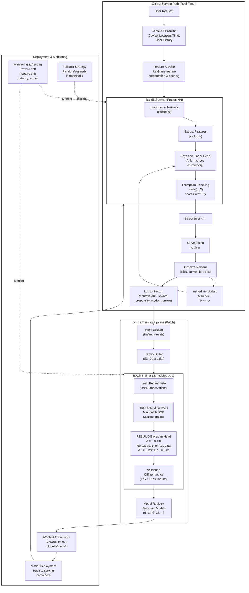

# Chapter 16: Contextual Bandits: Personalized Exploration and Exploitation

In Chapter 15, we learned how Multi-Armed Bandits balance exploration and exploitation to minimize regret when choosing between a fixed set of arms. But what happens when the best choice varies by user or situation? What if mobile users prefer different content than desktop users, or if the best product recommendation depends on a customer's purchase history?

**Contextual Multi-Armed Bandits** extend the basic MAB framework by incorporating **side information**—context—about the user, page, or situation at each decision point. Instead of asking "Which arm is best overall?", we ask "Which arm is best for *this* user in *this* context right now?" This shift enables powerful personalization use cases: tailoring content by device type, geography, user history, or time of day, and handling large, fast-changing catalogs where new items arrive continuously.

This chapter covers the algorithms, architectures, and practical considerations for deploying contextual bandits in production, featuring a deep dive into Netflix's artwork personalization system.

- [Chapter 16: Contextual Bandits: Personalized Exploration and Exploitation](#chapter-16-contextual-bandits-personalized-exploration-and-exploitation)
  - [1. From Context-Free to Context-Aware Decision Making](#1-from-context-free-to-context-aware-decision-making)
  - [2. LinUCB (Linear Upper Confidence Bound)](#2-linucb-linear-upper-confidence-bound)
  - [3. Thompson Sampling for Linear Models (LinTS)](#3-thompson-sampling-for-linear-models-lints)
  - [4. Shared Models: Encoding Arms as Features](#4-shared-models-encoding-arms-as-features)
  - [5. Practical Considerations](#5-practical-considerations)
  - [6. Neural Bandits](#6-neural-bandits)
    - [6.1. Neural-Linear Thompson Sampling](#61-neural-linear-thompson-sampling)
    - [6.2. Production Design of Neural-Linear TS](#62-production-design-of-neural-linear-ts)
  - [7. Alternative Approaches That Capture More Uncertainty](#7-alternative-approaches-that-capture-more-uncertainty)
    - [7.1. Bootstrapped Ensembles (Deep Exploration)](#71-bootstrapped-ensembles-deep-exploration)
    - [7.2. MC Dropout (Monte Carlo Dropout)](#72-mc-dropout-monte-carlo-dropout)
  - [8. Industry Spotlight: Netflix's Artwork Personalization](#8-industry-spotlight-netflixs-artwork-personalization)
  - [9. Summary and Next Steps](#9-summary-and-next-steps)
  - [10. References and Further Reading](#10-references-and-further-reading)

---

<a id="sec-16-1"></a>
## 1. From Context-Free to Context-Aware Decision Making

The core loop adds a context observation step:

0. **Model reward as a function of current context and an arm chosen:** $\hat{r}_t = R(x_t, a)$.
1. **Observe context** $x_t$.
2. **Choose an arm** by computing the predicted reward for each arm given the current context, plus an uncertainty bonus for exploration.
3. **Observe reward** $r_t$.
4. **Update** the model $R$ with the tuple $(x_t, a, r_t)$.

***Note: In the most general form of Contextual MAB, context is per arm, hence so is the reward model as well: $R_a(x_{a,t}, a)$***

**Context notation:** We use $x_{a,t}$ to denote the context for arm $a$ at time $t$, which may include user features (device, location, history) and arm-specific features (category, attributes). When all arms share the same user/environment context, we write $x_t$. The choice between per-arm and shared contexts affects model architecture, discussed in Sections 2-4.

**When to use each approach:** Use per-arm context $x_{a,t}$ when arms have distinct features (e.g., article embeddings, product attributes). Use shared context $x_t$ when only user/environment varies (e.g., device, location). Most production systems concatenate both: $x_{a,t} = [x_{\text{user}, t}; x_{\text{arm}, a}]$, combining user features with arm-specific features to capture all relevant information.

Contextual bandits shine when the best choice varies by user or situation, when you have large dynamic action sets with frequent cold-start scenarios, and when you want to maximize reward *during* the learning process—not just learn and deploy afterward.

<a id="tbl-16-1"></a>
Table 16.1 — Comparison of MAB and Contextual MAB

| Aspect | MAB | Contextual MAB |
| :-- | :-- | :-- |
| What the policy sees | Only past rewards per arm (no context) | Per-round context x_t and often per-arm features x_{a,t} |
| Decision rule | Pick the globally best arm based on historical performance/uncertainty | Pick the best arm for this context; scores depend on x_t (and x_{a,t}) |
| Data efficiency | Needs many pulls per arm; struggles with large/changing action sets | Generalizes across users/items via features; better cold-start |
| Best for | Small, stable arm sets; one winner acceptable for most users | Personalization, geo/seasonality, large catalogs (content/ads/products) |
| Risks & trade-offs | May miss segment-specific winners; simpler to run | Requires good features and drift monitoring; risk of leakage/stale context |
| Complexity & logging | Per-arm counters; simple logs | Feature pipelines and model updates; log propensities, context snapshots, model version (for IPS/DR; see Chapter 19, Section 2.2) |
| Exploration | Needs exploration (UCB/TS/ε) | Same, but on context-aware scores; keep an exploration floor for rare segments |

Contextual MAB balances exploitation and exploration of each arm based on the predicted reward and the uncertainty of that prediction. Here are the two most practical methods for getting started, both assuming the reward model is approximately linear in the context vector.

---

<a id="sec-16-2"></a>
## 2. LinUCB (Linear Upper Confidence Bound)

LinUCB [1, 2] is the contextual analog of UCB1. It assumes the expected reward is approximately linear in the features for each arm. The features $x_{a,t}$ typically combine user/context features (device, location, history) with arm-specific features (item category, price, embeddings), creating a per-arm feature vector. 

**Per-arm model:** In this most general form, each arm has its own reward model with separate parameters $\theta_a$:

<a id="eq-16-1"></a>
$$
\mathbb{E}[r_t \mid x_{a,t}] \approx x_{a,t}^T \theta_a \tag{16.1}
$$

For each arm *a*, we maintain separate parameters and statistics:
*   $A_a = λI + Σ x x^T$ (a covariance matrix tracking feature correlations)
*   $b_a = Σ r x$ (a weighted sum of observed rewards)
*   $θ̂_a = A_a^{-1} b_a$ (the estimated parameter vector)

At decision time, we compute an upper confidence bound for each arm and choose the one with the highest score:

<a id="eq-16-2"></a>
$$
p_a = x_{a,t}^T \hat{\theta}_a + \alpha \sqrt{x_{a,t}^T A_a^{-1} x_{a,t}} \tag{16.2}
$$

The first term is the predicted reward; the second term is the uncertainty bonus (analogous to the UCB formula in Chapter 15, Equation 15.1).

**Intuition for the uncertainty bonus:** The term $\alpha \sqrt{x_{a,t}^T A_a^{-1} x_{a,t}}$ measures how "novel" the current context is for arm *a*. The matrix $A_a = Σ x·x^T$ accumulates information about explored feature directions—large where we have data, small where we don't. Its inverse $A_a^{-1}$ is large where data is scarce. The quadratic form $x_{a,t}^T A_a^{-1} x_{a,t}$ measures uncertainty in the current context direction: large for unexplored feature space (big exploration bonus), small for familiar contexts.

In Bayesian terms (assuming Gaussian noise with variance σ²), $A_a^{-1}$ is the posterior covariance over $θ_a$, and $\sqrt{x_{a,t}^T A_a^{-1} x_{a,t}}$ is the predicted reward's standard deviation—a confidence interval width.

After observing reward *r* for the chosen arm, we update: $A_a ← A_a + xx^T$ and $b_a ← b_a + rx$.

A minimal Python implementation of LinUCB maintains per-arm covariance matrices **A** and reward accumulators **b**, then computes the UCB score for each arm at selection time.

<a id="lst-16-1"></a>
Listing 16.1 — Minimal LinUCB implementation
```python
import numpy as np

class LinUCB:
    def __init__(self, n_arms, n_features, alpha=1.0, ridge=1.0):
        self.n_arms = n_arms
        self.n_features = n_features
        self.alpha = alpha
        I = np.eye(n_features)
        self.A = [ridge * I.copy() for _ in range(n_arms)]  # dxd
        self.b = [np.zeros((n_features,)) for _ in range(n_arms)]  # d

    def _theta_and_inv(self, arm):
        A_inv = np.linalg.inv(self.A[arm])
        theta_hat = A_inv @ self.b[arm]
        return theta_hat, A_inv

    def select(self, X):  # X: (n_arms, n_features) contexts at time t
        scores = np.empty(self.n_arms)
        for a in range(self.n_arms):
            theta_hat, A_inv = self._theta_and_inv(a)
            x = X[a]
            mean = x @ theta_hat
            bonus = self.alpha * np.sqrt(x @ A_inv @ x)
            scores[a] = mean + bonus
        return int(np.argmax(scores))

    def update(self, arm, x, reward):
        x = x.reshape(-1, )
        self.A[arm] += np.outer(x, x)
        self.b[arm] += reward * x

# Note: Production code should add input validation (X.shape matches n_arms)
# and handle singular matrices (check condition number of A before inversion).
```

**Computational Complexity:** LinUCB selection is O(Kd² + d³) for K arms with d features: O(d³) to invert A (once per arm), then O(d²) per arm for matrix-vector products. The inversion cost dominates for large d. In practice, cache A⁻¹ and update incrementally using the Sherman-Morrison formula when possible. For very high dimensions (d > 1000), consider random feature approximations or neural representations (Section 6).

---

<a id="sec-16-3"></a>
## 3. Thompson Sampling for Linear Models (LinTS)

LinTS [3] is the Bayesian probability-matching version of LinUCB. Instead of computing an upper confidence bound, we sample a plausible parameter vector from the posterior distribution and choose the arm with the highest predicted reward under that sample.

Pseudocode (shared parameters):

<a id="lst-16-2"></a>
Listing 16.2 — Thompson Sampling for linear models (pseudocode)

```python
# Maintain A = λI + ∑ φφ^T and b = ∑ rφ over chosen arms (φ is the feature vector)
def select_arm(Phi_candidates, A, b, sigma2=1.0):
    A_inv = np.linalg.inv(A)
    theta_hat = A_inv @ b
    # Thompson step: sample a plausible parameter vector
    theta_sample = np.random.multivariate_normal(mean=theta_hat, cov=sigma2 * A_inv)
    scores = Phi_candidates @ theta_sample
    return int(np.argmax(scores))
    # ... (return statement above; error handling omitted for brevity)

def update(A, b, phi, r):
    A += np.outer(phi, phi)
    b += r * phi
```

**Which should you choose?**

Start with **LinUCB**—it's fast, well-understood, and requires minimal tuning. If you find that exploitation is too conservative or that the linearity assumption is too limiting, try **LinTS** for its probability-matching behavior. For highly non-linear reward functions, consider moving to a neural representation with a linear head for uncertainty (discussed in Section 6).

LinTS provides an elegant alternative to LinUCB, but both methods share a limitation: they maintain separate parameters for each arm. This works well for dozens or hundreds of arms, but what about thousands? And how do we handle cold-start when new arms arrive with no historical data? Section 4 addresses these challenges with shared models.

---

<a id="sec-16-4"></a>
## 4. Shared Models: Encoding Arms as Features

The LinUCB and LinTS algorithms shown in Sections 2-3 use **per-arm parameters**—each arm has its own $θ_a$, $A_a$, and $b_a$. This works well when you have hundreds of observations per arm, but breaks down in three scenarios:

1. **Cold-start:** New arms have no data, so their parameters are uninformed
2. **Large action spaces:** With thousands of arms (e.g., product catalog), maintaining separate parameters is computationally expensive
3. **Sparse data:** Most arms receive few pulls, leading to high-variance parameter estimates

**Shared model solution:** Use a single model (one θ, A, b) that takes arm-specific features as input. Instead of learning separate parameters per arm, the model learns to predict rewards based on arm attributes (category, price, embeddings, etc.) concatenated with user context. This enables generalization: knowledge transfers across arms with similar features.

**Architecture Comparison:**

| Aspect | Per-Arm Parameters (Section 2) | Shared Parameters (This Section) |
| :--- | :--- | :--- |
| **Input** | User features only: x_user = [device, location, time_of_day] | Concatenated: x = [x_user; x_arm] = [device, location, time_of_day, **arm_category, arm_price, arm_embedding, ...**] |
| **Model** | Separate model per arm: θ_arm1, θ_arm2, θ_arm3, ... | Single model: θ |
| **Prediction** | $\hat{r}_{a} = x_{\text{user}}^T \theta_a$ | $\hat{r} = [x_{\text{user}}; x_{\text{arm}}]^T \theta$ |

**Code Example: Recommendation System with Shared LinUCB**

Suppose we're recommending articles to users. We have 1000 articles (arms) and want to personalize based on user context.

<a id="lst-16-3"></a>
Listing 16.3 — Feature encoding for shared LinUCB model
```python
import numpy as np

class SharedLinUCB:
    """Shared LinUCB with arm features encoded in context."""
    
    def __init__(self, n_user_features, n_arm_features, alpha=1.0, ridge=1.0):
        self.n_user_features = n_user_features
        self.n_arm_features = n_arm_features
        self.n_features = n_user_features + n_arm_features
        self.alpha = alpha
        
        # Single shared model across all arms
        self.A = ridge * np.eye(self.n_features)
        self.b = np.zeros(self.n_features)
    
    def _build_context(self, user_features, arm_features):
        """Concatenate user and arm features."""
        return np.concatenate([user_features, arm_features])
    
    def select(self, user_features, candidate_arms_features):
        """
        Select best arm from candidates.
        
        Args:
            user_features: shape (n_user_features,) - e.g., [is_mobile, hour_of_day, ...]
            candidate_arms_features: shape (n_candidates, n_arm_features)
                                    - e.g., each row is [category_tech, category_sports, 
                                            article_age_hours, ...]
        
        Returns:
            best_arm_idx: index into candidate_arms_features
        """
        A_inv = np.linalg.inv(self.A)
        theta_hat = A_inv @ self.b
        
        n_candidates = len(candidate_arms_features)
        scores = np.zeros(n_candidates)
        
        for i in range(n_candidates):
            # Build full context vector for this (user, arm) pair
            x = self._build_context(user_features, candidate_arms_features[i])
            
            # UCB score: predicted reward + uncertainty bonus
            mean = x @ theta_hat
            bonus = self.alpha * np.sqrt(x @ A_inv @ x)
            scores[i] = mean + bonus
        
        return int(np.argmax(scores))
    
    def update(self, user_features, arm_features, reward):
        """Update model after observing reward."""
        x = self._build_context(user_features, arm_features)
        self.A += np.outer(x, x)
        self.b += reward * x


# Example usage: Article recommendation
n_user_features = 5   # device_type (3 one-hot), hour_of_day (1), user_engagement_score (1)
n_arm_features = 4    # category (2 one-hot), article_age_hours (1), author_popularity (1)

bandit = SharedLinUCB(n_user_features, n_arm_features, alpha=1.5)

# User arrives: mobile user at 2pm with high engagement
user_context = np.array([
    0, 1, 0,    # device: [desktop, mobile, tablet] - mobile user
    14,         # hour_of_day: 2pm
    0.8         # user_engagement_score: 0-1 scale
])

# Candidate articles (retrieved by separate ranking system)
candidates = np.array([
    [1, 0, 2.5, 0.7],   # Article 1: tech category, 2.5 hours old, popular author
    [0, 1, 0.5, 0.3],   # Article 2: sports category, fresh, less popular author  
    [1, 0, 24, 0.9],    # Article 3: tech category, 1 day old, very popular author
])

# Select and serve
chosen_idx = bandit.select(user_context, candidates)
print(f"Serving article {chosen_idx + 1}")

# User clicks (reward = 1)
bandit.update(user_context, candidates[chosen_idx], reward=1)
```

**Key Benefits of Shared Models:**

1. **Generalization:** The model learns that "mobile users at 2pm prefer fresh tech articles"—this knowledge transfers to all tech articles, not just those seen before
2. **Cold-start resilience:** A brand new article with features [1, 0, 0.1, 0.8] immediately benefits from learned patterns about tech articles and popular authors
3. **Data efficiency:** Every observation updates the shared θ, so learning is faster than per-arm models that split data K ways
4. **Scalability:** Adding 100 new articles requires no model changes—just compute their arm features

**When to Use Shared vs. Per-Arm:**

| Scenario | Recommendation |
| :--- | :--- |
| <500 arms, each gets 100+ pulls | Per-arm (maximal flexibility) |
| >1000 arms, or frequent new arms | Shared (better generalization) |
| Arms have rich features | Shared (leverage arm attributes) |
| Arms have no meaningful features | Per-arm or add one-hot arm IDs as last resort |
| Cold-start is critical | Shared (transfer learning via features) |

**Note on arm IDs:** You rarely need to encode arm identity (e.g., one-hot arm IDs) in shared models. If your arms already have descriptive features (category, price, embeddings), the model learns from those attributes. Only add arm IDs if: (1) arms have no features and you can't use per-arm models, or (2) you want to capture arm-specific idiosyncrasies after learning from features (hybrid approach: [x_user; x_arm_features; sparse_arm_id_onehot]).

In practice, **start with shared models using arm features**—they're more robust and work for most use cases. Only switch to per-arm if you have abundant data and arms are truly heterogeneous with no useful feature representation.

---

<a id="sec-16-5"></a>
## 5. Practical Considerations

**Feature Engineering**

Combine user/context features (device, locale, recency) with arm/item features (category, freshness, embeddings) and interaction terms (user×item). The quality of features directly impacts how quickly the bandit learns and generalizes.

**Candidate Generation**

In large catalogs, first retrieve K candidates using approximate nearest neighbors (ANN) or BM25, then apply the bandit to that small set. This two-stage approach maintains low latency while focusing exploration on relevant items.

**Cold-Start Handling**

Use shared models (see Section 4) to transfer knowledge to new arms via their features. Alternatively, use informed priors for per-arm models based on historical performance. Maintain a small exploration floor (5-10% traffic) for new items to ensure they receive sufficient data before being abandoned.

**Non-Stationarity**

Discount history (A ← γA, b ← γb with γ < 1) or use sliding windows to down-weight old observations. Monitor reward distributions for drift and retrain when patterns shift.

**Fairness and Safety**

Enforce minimum exploration per user segment (e.g., geo region, device type) to avoid under-serving minority groups. Add exposure caps and clear guardrails to prevent runaway exploitation. Log propensities, context snapshots, and model version for offline evaluation (see Chapter 19, Section 2.2 for IPS/DR methods).

**Binary Rewards**

For binary outcomes, a logistic link *P(r=1|x,a) = σ(x^T θ)* is common. In practice, LinUCB and LinTS remain effective approximations even with this non-linear model.

**Logging for Offline Evaluation**

Keep math light, but keep logs rich: record chosen actions, propensities (selection probabilities), full context snapshots, and observed rewards. This enables safe offline evaluation with IPS (Inverse Propensity Scoring) and DR (Doubly Robust) estimators (see Chapter 19, Section 2.2 for detailed coverage).

**Hyperparameter Selection**

| Parameter | Typical Range | Recommendation |
|-----------|---------------|----------------|
| α (LinUCB exploration) | 0.1-2.0 | Start with 1.0; increase if under-exploring |
| Ridge λ | 0.1-1.0 | 1.0 for small feature sets, 0.1 for high-dimensional |
| Batch size (neural) | 16-128 | 32 for most cases |
| Update frequency | 100-1000 obs | Every 100-500 for fast-changing domains |

**Privacy and Compliance**

Ensure user consent for feature collection and personalization. Anonymize logs per GDPR/CCPA requirements (remove direct identifiers, use hashed user IDs). For sensitive applications, consider differential privacy on feature values or model parameters. Implement data retention policies (e.g., delete logs after 90 days).

**Monitoring and Diagnostics**

Track these metrics continuously to detect issues:
- **Reward distribution drift**: Monitor mean and variance of observed rewards. Alert if p5 or p95 shifts >20% week-over-week.
- **Feature drift**: Compute KL divergence between current and historical feature distributions. Alert if divergence exceeds threshold.
- **Selection entropy**: H = -Σ p_a log(p_a) measures exploration diversity. Low entropy (<0.5 for normalized K arms) suggests premature convergence.
- **Arm coverage**: Ensure all arms receive minimum exploration (e.g., 1% traffic) to detect quality shifts early.
- **Feature-reward correlation**: Periodically verify that features correlate with rewards (Pearson r > 0.1). Fall back to random exploration if correlations degrade.

**Diagnosing Linear Model Failure** - When to switch from LinUCB to neural methods:
- Residual plots show clear non-linear patterns (e.g., quadratic or interaction effects)
- Neural network achieves >20% lower validation loss on held-out data
- Reward improvements plateau despite collecting more data

---

<a id="sec-16-6"></a>
## 6. Neural Bandits

When the reward function is highly non-linear and the linear assumption of LinUCB/LinTS breaks down, neural networks can learn more expressive representations. The key challenge is maintaining uncertainty estimates for exploration.

### 6.1. Neural-Linear Thompson Sampling
**Neural-Linear Thompson Sampling** [5] provides a strong baseline: use a small neural network to learn a feature representation φ = f_θ(x), then maintain a Bayesian linear head on φ for uncertainty quantification. This approach combines the representational power of neural networks with principled uncertainty estimation from Bayesian linear models.

**Architecture:** The neural network learns features φ = f_θ(x), then a Bayesian linear head predicts reward as w^T φ. The "Bayesian" aspect: we maintain a posterior distribution over w (tracked by A and b matrices) rather than a point estimate, enabling principled uncertainty quantification.

**Training:** Both components train jointly end-to-end via gradient descent on standard supervised loss (MSE or cross-entropy). Batch updates occur every N steps (e.g., N=100) to amortize computation.

**Inference for exploration:** The neural network freezes (fixed feature extractor), while the Bayesian linear head maintains uncertainty. Sample w from the posterior (using A, b as in LinUCB/LinTS) to get exploration bonuses.

<a id="lst-16-4"></a>
Listing 16.4 — Neural-linear Thompson Sampling (pedagogical pseudocode, not runnable)
```python
# PEDAGOGICAL PSEUDOCODE - Production needs: batch processing, error handling,
# checkpointing, gradient clipping, learning rate scheduling, etc.

import numpy as np
import torch
import torch.nn as nn

class NeuralLinearBandit:
    def __init__(self, input_dim, hidden_dim, feature_dim):
        # Neural network: context → features
        self.feature_net = nn.Sequential(
            nn.Linear(input_dim, hidden_dim), nn.ReLU(),
            nn.Linear(hidden_dim, feature_dim)
        )
        self.optimizer = torch.optim.Adam(self.feature_net.parameters())
        
        # Bayesian linear head: A and b for posterior inference
        self.A = np.eye(feature_dim)
        self.b = np.zeros(feature_dim)
        self.replay_buffer = []  # Store (x, a, r) tuples
    
    def select(self, context, candidate_arms):
        """Thompson sampling with neural features."""
        with torch.no_grad():
            phi = self.feature_net(context).numpy()  # Neural features (frozen)
        
        # Sample linear weights from posterior: w ~ N(μ, Σ)
        A_inv = np.linalg.inv(self.A)
        w_mean = A_inv @ self.b
        w_sample = np.random.multivariate_normal(w_mean, A_inv)
        
        # Score each arm with sampled weights
        scores = [w_sample @ phi for _ in candidate_arms]
        return np.argmax(scores)
    
    def update(self, context, arm, reward):
        """Update Bayesian head immediately, store for periodic NN retraining."""
        # Immediate update: Update Bayesian linear head with current features
        with torch.no_grad():
            phi = self.feature_net(context).numpy()  # Features from current NN
        self.A += np.outer(phi, phi)  # Instant update to posterior
        self.b += reward * phi
        
        # Store for later neural network retraining
        self.replay_buffer.append((context, arm, reward))
        
        # Trigger neural network retraining every 100 observations
        if len(self.replay_buffer) >= 100:
            self._train_batch()
            
    def _train_batch(self):
        """Batch training: update neural network via SGD, then update Bayesian head."""
        batch_size = 32
        n_epochs = 5
        
        # Step 1: Train neural network + linear head jointly via gradient descent
        for epoch in range(n_epochs):
            # Sample mini-batches from replay buffer
            indices = np.random.choice(len(self.replay_buffer), batch_size)
            batch = [self.replay_buffer[i] for i in indices]
            
            contexts = torch.stack([x for x, a, r in batch])
            rewards = torch.tensor([r for x, a, r in batch])
            
            # Forward pass through neural network
            features = self.feature_net(contexts)  # (batch_size, feature_dim)
            
            # Linear head prediction (using current point estimate of w)
            A_inv = np.linalg.inv(self.A)
            w_current = A_inv @ self.b
            predictions = features @ torch.tensor(w_current, dtype=torch.float32)
            
            # Loss and backprop through entire network
            loss = ((predictions - rewards) ** 2).mean()
            self.optimizer.zero_grad()
            loss.backward()  # Gradients flow through NN and into features
            self.optimizer.step()
        
        # Step 2: COMPLETELY REBUILD Bayesian linear head with new features
        # The neural network has changed, so the feature space φ is different.
        # Old A and b matrices are now meaningless - we must recompute from scratch.
        self.A = np.eye(self.A.shape[0])  # Reset to prior
        self.b = np.zeros_like(self.b)    # Reset to prior
        
        with torch.no_grad():
            for x, a, r in self.replay_buffer:
                phi = self.feature_net(x).numpy()  # NEW features from retrained NN
                self.A += np.outer(phi, phi)       # Rebuild posterior statistics
                self.b += r * phi
        
        self.replay_buffer.clear()
```

**Key points illustrated:**
1. **Replay buffer** (line 48): Accumulate observations, not incremental updates
2. **Batch training** (line 57-76): Proper mini-batch SGD with multiple epochs (realistic for neural networks). 
3. **Joint optimization** (line 73-75): Gradients flow through entire network during training
4. **COMPLETE rebuild** (line 79-86): After neural features change, A and b are reset and rebuilt from scratch
   - Old A/b become invalid because φ_old ≠ φ_new (different feature space)
   - Must re-extract features for ALL observations and recompute posterior
   - This is why the linear head is "completely updated" during NN retraining
5. **Frozen inference** (line 20): At selection time, neural network runs in no-grad mode (fixed features)
6. **Thompson sampling** (line 23-25): Sample linear weights from posterior for exploration

**Update Frequency: Two-Speed Learning**

Neural-linear bandits use a **two-speed update strategy** that maintains exploration-exploitation balance:

**Fast updates (per-observation):** The Bayesian linear head (A and b matrices) updates instantly after every observation:
```python
phi = feature_net(context)  # Extract features from current (frozen) NN
self.A += np.outer(phi, phi)  # Update posterior immediately
self.b += reward * phi
```
This means the **exploration-exploitation trade-off adapts continuously** - if an arm starts performing poorly, its uncertainty decreases and it gets explored less within seconds, even if the neural network hasn't retrained yet.

**Slow updates (batched, every few hours):** Both the neural network AND the linear head are completely updated together:
```python
# Every 1000 observations or every 6 hours:
train_neural_network_on_replay_buffer()  # NN parameters θ change via backprop
# Linear head is COMPLETELY REBUILT:
A = I, b = 0  # Reset to prior
for all observations:
    φ = feature_net(x)  # Extract NEW features from retrained NN
    A += φφ^T, b += rφ  # Rebuild posterior from scratch
```
**Critical point:** When the neural network retrains, the feature space changes (φ_old → φ_new), so the old A and b matrices become meaningless. The linear head must be completely rebuilt - you can't incrementally update it. This is a **full reset** of the Bayesian posterior, not an incremental refinement.

**Key insight:** Exploration rates update instantly via the Bayesian head, even when neural features are frozen. The neural network provides good features; the linear head quantifies uncertainty *given those features*. Between retraining cycles, the bandit explores effectively based on current (frozen) features—responsive exploration with deep feature learning benefits.

**Important caveat:** Neural-linear methods assume uncertainty comes *only* from the linear layer on top of the neural features. The neural network parameters θ are treated as fixed point estimates when computing uncertainty. This means:
- **Captures:** Uncertainty in the reward prediction given the learned features φ
- **Ignores:** Uncertainty in the feature representation itself (which neural parameters θ are correct?)

This is a pragmatic trade-off—full Bayesian inference over neural network weights is computationally prohibitive. The method works well when the neural network has sufficient capacity and data to learn stable features, but may underestimate uncertainty in the early stages of learning or with distribution shift.

### 6.2. Production Design of Neural-Linear TS

Listing 16.4 illustrates core concepts. For production, use frameworks like Vowpal Wabbit, ContextualBandits library, PyTorch-based implementations, or cloud services (AWS Personalize, Google Recommendations AI).

Production architecture:

<a id="fig-16-1"></a>

Figure 16.1 — Production architecture for Neural-Linear Thompson Sampling

**Architecture Components:**

**Online Serving Path (Real-Time):**
- **Context Extraction:** Captures user features (device, location, time, history) from request
- **Feature Service:** Computes and caches features with low latency (<10ms)
- **Bandit Service:** 
  - Neural network runs in **frozen mode** (no gradient computation) for fast inference
  - Extracts feature representation φ = f_θ(x)
  - Bayesian linear head maintains in-memory A and b matrices
  - Thompson Sampling draws w ~ N(μ, Σ) and computes scores
  - **Immediate update** of A and b after observing reward (per-request, <1ms)
- **Logging:** Streams events to data pipeline with full context for offline analysis

**Offline Training Pipeline (Batch, every 6-24 hours):**
- **Replay Buffer:** Stores recent observations (e.g., last 100K events) in data lake
- **Batch Trainer:**
  - Loads data and trains neural network via mini-batch SGD (standard supervised learning)
  - **Completely rebuilds** Bayesian linear head from scratch:
    - Reset A = I, b = 0
    - Re-extract features φ for ALL observations using new neural network
    - Recompute A = Σ φφ^T and b = Σ rφ
  - Validates using offline metrics (IPS, DR estimators; see Chapter 19, Section 2.2)
- **Model Registry:** Stores versioned models with metadata (training date, validation metrics)

**Deployment & Monitoring:**
- **A/B Testing:** Gradually rolls out new model versions (e.g., 5% → 20% → 50% → 100%)
- **Model Deployment:** Pushes to serving containers with atomic swap (zero downtime)
- **Monitoring:** Tracks reward drift, feature drift, latency, error rates, exploration rates
- **Fallback:** Switches to random or ε-greedy policy if model fails health checks

**Key Design Decisions:**

1. **Two-Speed Learning:** Fast Bayesian updates (per-request) maintain exploration-exploitation balance while neural network improves features slowly (batch)

2. **Frozen Inference:** Neural network runs without gradients during serving for <5ms latency; only backprop happens offline

3. **Complete Rebuild:** Bayesian head cannot be incrementally updated when NN changes—must rebuild from scratch with new features

4. **Rich Logging:** Captures propensities, full context, model version for offline evaluation (IPS/DR) and debugging

5. **Gradual Rollout:** A/B tests new model versions to detect regressions before full deployment

6. **Stateful Service:** Bayesian head (A, b matrices) lives in-memory for instant updates; persisted periodically for crash recovery

This architecture achieves:
- **<10ms** p99 latency for arm selection
- **Real-time** exploration adaptation (Bayesian head updates instantly)
- **Safe** model updates via A/B testing and offline validation
- **Observable** system with rich monitoring and fallback strategies

---

<a id="sec-16-7"></a>
## 7. Alternative Approaches That Capture More Uncertainty

The neural-linear approach treats the neural network as a point estimate, ignoring uncertainty in the learned features. Two alternatives address this limitation by quantifying uncertainty in both the features and predictions:

### 7.1. Bootstrapped Ensembles (Deep Exploration)

Train K independent neural networks (e.g., K=5-10) on different bootstrapped samples of the training data. At inference time, run all K models and use their disagreement as an uncertainty signal.

**How it works:**
- Each network sees slightly different training data (sampling with replacement)
- Networks learn different feature representations due to random initialization and data variation
- Disagreement = variance of predictions across ensemble members
- High disagreement → high uncertainty → exploration bonus

**Uncertainty formula:** For arm *a* with context *x*, compute predictions from all K models:
$$
\hat{r}_1, \hat{r}_2, \ldots, \hat{r}_K = f_{\theta_1}(x), f_{\theta_2}(x), \ldots, f_{\theta_K}(x)
$$

Uncertainty bonus = $\beta \cdot \text{std}(\hat{r}_1, \ldots, \hat{r}_K)$ where β is a hyperparameter.

**Thompson Sampling variant:** Sample one network uniformly at random, use its prediction for arm selection. Networks that consistently predict well get implicitly weighted higher over time.

**Trade-offs:**
- ✓ Captures uncertainty in both features and predictions (addresses neural-linear's main weakness)
- ✓ No approximation—ensemble disagreement is a direct measure of epistemic uncertainty
- ✗ Requires training and serving K models (K× computational cost and memory)
- ✗ Inference latency: Must run K forward passes (can parallelize but still slower)
- ✗ More complex deployment: Need to version and sync multiple models

**When to use:** High-stakes applications where underestimating uncertainty is costly (medical treatment selection, financial decisions). The computational overhead is justified when exploration mistakes are expensive.

### 7.2. MC Dropout (Monte Carlo Dropout)

MC dropout keeps dropout layers *active* at inference time to approximate Bayesian uncertainty. Standard dropout zeros neurons randomly during training to prevent overfitting. MC dropout extends this by running multiple stochastic forward passes at inference—the variance across predictions estimates uncertainty.

**How it works:**
- Add dropout layers to neural network (typically dropout rate p=0.1-0.2)
- During training: Dropout active as usual
- During inference: Keep dropout active, run T forward passes (e.g., T=10-50), each pass with a random dropout mask of the given dropout rate.
- Each forward pass produces a different prediction due to random dropout mask
- Variance across T predictions estimates uncertainty

**Uncertainty formula:** For arm *a* with context *x*, run T stochastic forward passes:
$$
\hat{r}_1, \hat{r}_2, \ldots, \hat{r}_T = f_{\theta}(x; \text{dropout}_1), f_{\theta}(x; \text{dropout}_2), \ldots, f_{\theta}(x; \text{dropout}_T)
$$

Uncertainty bonus = $\alpha \cdot \text{std}(\hat{r}_1, \ldots, \hat{r}_T)$.

**Interpretation:** Each dropout mask samples a different sub-network. The collection of sub-networks approximates a Bayesian posterior over network weights. High variance means the model is uncertain.

**Trade-offs:**
- ✓ Lightweight: Single model, just add dropout layers
- ✓ No retraining needed: Works with existing trained networks (if they have dropout)
- ✓ Reasonable uncertainty estimates for free
- ✗ Requires careful tuning: Dropout rate p and number of samples T are critical
  - Too low p: Underestimates uncertainty (insufficient stochasticity)
  - Too high p: Network doesn't learn well, predictions are too noisy
  - Too low T: Noisy variance estimates
  - Too high T: Increased latency
- ✗ Theoretical concerns: MC dropout approximation quality depends on network architecture and dropout placement
- ✗ Doesn't capture all uncertainty: Only approximates parameter uncertainty, not model misspecification

**When to use:** When you need better uncertainty than neural-linear but can't afford ensembles. Good middle ground for production systems with moderate stakes. Particularly effective for computer vision and NLP tasks where dropout is already common.

**Comparison Summary:**

| Aspect | Neural-Linear (Section 6.1) | Bootstrapped Ensembles | MC Dropout |
|:-------|:---------------------------|:-----------------------|:-----------|
| **Uncertainty captured** | Linear head only | Features + predictions | Approximate Bayesian |
| **Computational cost** | 1× model, instant updates | K× models (K=5-10) | 1× model, T× inference |
| **Memory footprint** | Single model + A, b | K× model size | Single model |
| **Inference latency** | 1× forward pass | K× forward pass | T× forward pass (T=10-50) |
| **Exploration quality** | Good (proven in production) | Excellent (true epistemic uncertainty) | Good (approximate) |
| **Implementation complexity** | Moderate (two-speed learning) | High (ensemble management) | Low (just add dropout) |
| **Best for** | Most production use cases | High-stakes decisions | Medium-stakes, quick deployment |

**Recommendation:** In practice, neural-linear offers the best simplicity-to-performance ratio for most applications. Start with linear models (LinUCB/LinTS) and only move to neural architectures when you have substantial data (10K+ samples per arm) and clear evidence that linearity is insufficient. If neural-linear's uncertainty underestimation becomes a problem, try MC dropout first (easy to implement), then consider bootstrapped ensembles if the stakes justify the cost.

---

<a id="sec-16-8"></a>
## 8. Industry Spotlight: Netflix's Artwork Personalization

Netflix uses contextual bandits to personalize artwork for titles [4], selecting from multiple images based on user preferences and viewing context. A user who enjoys romantic comedies might see a couple embracing, while an action fan sees an explosion. The system learns from billions of impressions daily, balancing exploration of new artwork with exploitation of proven winners.

**System Architecture:**
- **Candidate Generation:** For each title, designers create 5-20 artwork variants
- **Feature Engineering:** User features (genre preferences, viewing history, device) + artwork features (color palette, composition, faces vs. objects)
- **Model:** Shared neural-linear bandit—single model across all titles, with artwork and user features as input
- **Two-stage selection:** 
  1. Retrieve top-K titles via collaborative filtering
  2. For each title, bandit selects personalized artwork
- **Real-time updates:** Bayesian head updates instantly on click/play events
- **Batch retraining:** Neural network retrains nightly on previous day's data

**Key Challenges Overcome:**
1. **Massive scale:** 200M+ users, 10K+ titles, 100K+ artwork variants
2. **Cold-start:** New titles/artwork have no history—shared model transfers knowledge from similar items
3. **Non-stationarity:** User preferences evolve; system uses sliding windows to down-weight old observations
4. **Fairness:** Exploration floor ensures all artwork variants receive minimum exposure to avoid premature convergence

**Business Impact:**
- Significant increase in engagement from personalized artwork vs. single default image
- Faster time-to-watch for new titles (better first impressions)
- Enables A/B testing of artwork strategies without traffic overhead

**Lessons for practitioners:**
- **Start simple:** Netflix initially used LinUCB before graduating to neural models
- **Feature quality matters:** Investment in artwork embeddings (color, composition) was critical
- **Monitor continuously:** Reward drift detection caught seasonal preference shifts
- **Fallback gracefully:** Default artwork shown if bandit fails latency SLA

---

<a id="sec-16-9"></a>
## 9. Summary and Next Steps

Contextual bandits extend the exploration-exploitation framework to personalization, enabling systems to adapt decisions based on user context, situation, and arm features. Key takeaways:

**When to use contextual bandits:**
- Best choice varies by user/segment (personalization use cases)
- Large, dynamic action spaces with frequent cold-start scenarios
- Goal is maximizing cumulative reward *during* learning, not just after

**Algorithm selection:**
- **LinUCB/LinTS:** Start here for linear reward functions, fast inference, minimal tuning
- **Shared models:** Use for large catalogs, cold-start resilience, data efficiency
- **Neural bandits:** Only when you have substantial data (10K+ samples) and clear evidence of non-linearity

**Production considerations:**
- Rich logging (context, propensities, model versions) for offline evaluation
- Two-stage architecture (candidate retrieval + bandit selection) for scalability
- Gradual model rollout with A/B testing for safety
- Monitoring for reward drift, feature drift, and fairness

**Relationship to other methods:**
- Contextual bandits sit between pure A/B testing (full exploration) and pure exploitation (no learning)
- For long-term model development, use experiment data for counterfactual learning (Chapter 19)
- For hyperparameter optimization, use Bayesian optimization (Chapter 18)
- For testing ML systems with contextual features, see Chapter 17

In the next chapter, we return to the world of controlled experiments and explore the unique challenges of designing experiments for machine learning systems.

---

<a id="sec-16-10"></a>
## 10. References and Further Reading

[1] Li, L., Chu, W., Langford, J., & Schapire, R. E. (2010). A contextual-bandit approach to personalized news article recommendation. *Proceedings of the 19th International Conference on World Wide Web* (WWW), 661-670.

[2] Chu, W., Li, L., Reyzin, L., & Schapire, R. E. (2011). Contextual bandits with linear payoff functions. *Proceedings of the 14th International Conference on Artificial Intelligence and Statistics* (AISTATS), 208-214.

[3] Agrawal, S., & Goyal, N. (2013). Thompson Sampling for contextual bandits with linear payoffs. *Proceedings of the 30th International Conference on Machine Learning* (ICML), 127-135.

[4] Chandrashekar, A., Amat, F., Basilico, J., & Jebara, T. (2017). *Artwork Personalization at Netflix*. The Netflix Tech Blog. Retrieved from https://netflixtechblog.com/artwork-personalization-c589f074ad76

[5] Riquelme, C., Tucker, G., & Snoek, J. (2018). Deep Bayesian bandits showdown: An empirical comparison of Bayesian deep networks for Thompson sampling. *Proceedings of the 6th International Conference on Learning Representations* (ICLR).
